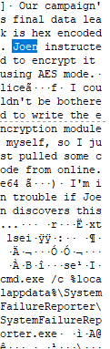

랜섬웨어 

https://www.igloo.co.kr/security-information/%EC%82%AC%EB%A1%80%EB%A1%9C-%EC%82%B4%ED%8E%B4%EB%B3%B4%EB%8A%94-%EB%9E%9C%EC%84%AC%EC%9B%A8%EC%96%B4-%EA%B0%90%EC%97%BC%EA%B2%BD%EB%A1%9C-%EB%B6%84%EC%84%9D%EB%B0%A9%EC%95%88/

랜섬웨어 특징
감염된 파일은 파일 형식이 같음.(이상한 조합)

1. 랜섬웨어 종류별로 감염경로나 복구가능 여부, 방지대책등이 상이할 수 있으므로 종류를 파악하는게 중요함
2. 감염 경로를 파악

파일에 의한 감염은 주로 메일,SNS로 유포된다고 함
=> 메일의 정보를 찾아보기

메일정보를 확인할 때 주의할 부분은 발신자(From) 정보는 위조할 수 있기 때문에 Received의 정보를 통해서 실제 발신자의 정보를 확인해야 한다. Received정보가 1개 이상 보이는 경우에는 가장 상단의 정보가 마지막 정보이기 때문에 가장 하단의 정보가 처음 보낸 발신자의 정보다. 

---
취약한 사이트를 통해 감염되는 경우
1. 브라우저의 접속 정보를 확인해야 함
Explorer, Firefox, Chrome,Safari 인터넷 접속기록 쉽게 확인하려면 BrowsingHistoryView 사용

여기서 랜섬웨어 유포지로 의심되는 URL이 있다면, 의심URL의 정상유무 파악을 위해 Virus Total이나 Malwares를 통해 분석정보 확인

2. 랜섬웨어 의심정보 확인
랜섬웨어가 설치됐다면 파일이 어떤 것인지, 언제 실행했는지 확인
=> Directory Snoop은 프로그램을 제거할 때 파일의 남겨지는 내용을 완전히 삭제해주거나, 복구 기능 지원

REGA로 레지스트리 분석 가능

3. 복구가능여부 확인
일부 랜섬웨어는 복호키가 공개되어 있어 복호화 가능

랜섬웨어 분석에서 처음 해야 하는 일이 “랜섬웨어 종류 파악”하는 이유는 이와 같이 복호화가 가능한 랜섬웨어일 가능성 때문에 확인이 필요

오카카는 파일에 의한 감염(파일 다운로드)
주요 파일이 암호화되고, 랜섬노트 생성 확인
감염 원인 파악 및 작성 중이던 지원서 복구

---

디지털 포렌식 분석
침투 경로 파악
피해 범위 식별
랜섬웨어 종류 특정
정보 유출 여부 확인

위와 유사한 것 같음
공격의 흔적을 찾는 기술 느낌

파일시스템 구조: 파일이 디스크에 어떻게 저장되고 삭제되는지 알아야 합니다. 특히 Windows의 NTFS 파일시스템에 대한 이해가 중요합니다. 파일의 생성/수정/접근 시간을 기록하는 MAC 타임스탬프의 의미를 알면 공격의 순서를 재구성(타임라인 분석)하는 데 결정적입니다.

Windows 아티팩트 (Artifacts): Windows 운영체제는 사용자와 프로그램의 행위를 다양한 '흔적(아티팩트)'으로 남깁니다. 랜섬웨어 분석 시 반드시 확인해야 할 항목들입니다.

프리페치 (Prefetch): 어떤 프로그램이 언제, 몇 번 실행되었는지 알려주는 파일입니다. 랜섬웨어 실행 증거를 찾을 수 있습니다.

LNK 파일 (바로 가기) 및 점프 목록 (Jump Lists): 사용자가 최근에 열어본 파일이나 폴더의 흔적입니다. 랜섬웨어가 접근했거나 암호화한 파일 목록을 유추할 수 있습니다.

레지스트리 (Registry): Windows의 모든 설정 정보가 담긴 데이터베이스입니다. 악성코드가 부팅 시 자동으로 실행되기 위해 등록하는 '지속성(Persistence)' 확보의 단골 장소입니다. (Run, RunOnce 키)

이벤트 로그 (Event Logs): 시스템 부팅, 사용자 로그인, 프로그램 실행/오류 등 시스템에서 발생한 주요 사건들을 기록합니다. 공격자의 원격 접속 시도나 비정상적인 프로세스 실행 기록을 찾을 수 있습니다.

--- 
상황을 보았을 때, Desktop 디렉토리에 ryk 확장자인 파일들로 보아 이 파일들이 랜섬웨어에 걸린 것 같음
ryk는 ryuk의 확장자
https://www.kisa.or.kr/20206/form?postSeq=19&page=1#fnPostAttachDownload

먼저 감염경로를 확인해야 할 것 같음.
=> 오카카는 출처가 불분명한 파일을 다운로드했다고 했으니까 웹사이트를 통한 감염확률이 높음
=> 브라우저의 접속 정보를 확인

https://digitalforensicmaster.tistory.com/entry/Digital-Forensic-Web-Browser-Log-Information-Analysis

브라우저 접속 기록을 확인하기위해 Appdata/local에 들어갔는데, Google만 있는 것으로 보아 Google 기록만 있는 것 같아서 google 기록 확인

download 시간순으로 정렬

urls 시간순으로 정렬

랜섬웨어가 걸린 시간은 13400100196173981 이전인 것 같음
아직은 뭐가 문제인지 모르겠음..

Download 파일을 봤을 때 Chrome 셋업과 Everything은 google에서 다운받은게 아닌 것 같음 하지만 다운로드 시간과 랜섬웨어걸린 파일의 modify 시간을 비교했을 때, 가능성이 없어보임

이전에 파일에 의한 감염은 주로 메일,SNS로 유포된다고 했으니까 메일 일지도..? 메일을 찾아봐야할 것 같음

History 지워져있던 파일이 있는데 이걸 복구해서 보면 뭔가 나올지도 모를 것 같음
=> 삭제된 History에는 아무것도 존재하지 않았음

다시한번 DB를 보다보니 한 파일이 용량이 큰 사실을 알 수 있었음

https://www.igloo.co.kr/security-information/%EC%A0%95%EC%83%81%EC%9D%B8-%EB%93%AF-%EC%A0%95%EC%83%81-%EC%95%84%EB%8B%8C-%EC%A0%95%EC%83%81-%EA%B0%99%EC%9D%80-%ED%95%9C%EA%B8%80-%EB%AC%B8%EC%84%9C%ED%98%95-%EC%95%85%EC%84%B1%EC%BD%94%EB%93%9C/

xor을 해보려고 봤는데 뭔가 특별한게 나오진 않음
label exit length Encode처럼 다양한 단어를 찾다보니 문장이 있는 걸 찾게 됨

Joen은 AES로 암호화함
Joen한테 들키면 안됨

cmd.exe로 local/appdata/SystemFailureReporter.exe를 실행시킨다는 사실을 알 수 있다.

감염 업데이트를 위해 DnsQuery를 import한다고 하고, 워드에 VBA 매크로를 전략적으로 숨겨놨다고 적혀있는 걸 보니 랜섬웨어 감염파일이 맞는 것으로 확정지었다.

SystemFailureReporter를 SystemFaillureReporter로 작성해서 결과보고서에 제출해라. 이유 설명하지마라

찾아보고 있는데, 눈이 너무 아파서 Strings를 통해 vscode에서 확인

tls, crypto 들이 나오는 걸로 확인했고, x509이나 에러들이 보임 tls 연결을 하는 것 같음
wireshark로 확인해보는 게 좋을 것 같음

SystemErrorrepoter를 실행해보니, 내 컴퓨터의 안랩 보안이 drmon.chickenkiller.com이 유해하다고 차단되는 것을 확인했다.. 
이후 안랩의 보안을 끄고 들어가보니 공격자의 서버를 확인할 수 있었다

내 IP는 192.168.147.131 이므로, 공격자의 서버 IP는 182.228.44.206 인 사실을 알 수 있다.
공격을 실제로 당해보니, 마지막으로 Fin Ack를 보내면서 JSON 파일을 준다는 것을 알게되었다.

victim list에 Member id를 적어보니 내 가상환경이 등록되어있는 것을 확인할 수 있었다.

이제 AES 키를 찾으려고 SystemFailureReport를 찾아보다가 
url뒤에 svchost라는 경로가 보임

https://nordvpn.com/ko/blog/svchost-virus/?srsltid=AfmBOoo3I2NiYWypuU7XZMm6-WGXu8sCJQdAbD9LH2f8OvX2c5p1JzBw

여러개의 서비스를 호스팅하는 프로세스가 svchost.exe
안에 바이러스가 있을 것으로 추정됨
System32에 있는 svchost를 실행했는데 아무 일도 발생하지 않음..

https://learn.microsoft.com/en-us/answers/questions/2596250/svchost-exe-extensively-reads-my-hard-drive-after?utm_source=chatgpt.com
svchost가 여러개가 존재하는데, Temp에 있는 svchost.exe가 악성 파일이였음. 실행했더니 파일들이 류크확장자로 바뀜

https://m.blog.naver.com/chogar/223747138606?recommendCode=2&recommendTrackingCode=2
이벤트로그를 통해 서비스가 설치된 시간이나 전체 시간을 봤는데 랜섬웨어 감염된 시간이랑 겹치는 게 없음..

AES를 복호화하려면 키와 nonce 값을 알아야 한다는 것을 이전에 확인했었는데.. 키와 nonce를 찾을 수가 없다..

여기 나오는 enc_Data 사실은 nonce가 아닐까?
비밀 키를 저렇게 평문으로 줄 것 같지는 않음

흠.. Ryuk는 AES랑 RSA를 같이 쓴다고 했음
=> 내가 AES 비밀 키를 알아내려면, RSA 개인 키를 알아내야 하는 구조..? 내가 알 수 있는 건 암호화 걸린 AES 비밀 키..
enc_Data가 암호화걸린 AES 비밀키 + nonce의 조합일지도 모름

프로세스 ID를 얻어서 메모리에 그때 암호화되지 않은 aes키가 있을지도 모른다고 생각해서 PID를 찾아보려고 했는데, Timewait라고 나오면서 PID가 출력되지 않는다는 것을 알게됨

https://d0lk0ng.tistory.com/56?utm_source=chatgpt.com

    다른 방법이 없어서, 파일별로 차이점을 알기위해 각 파일을 찾아보았는데 헥사코드의 길이가 다르다는 것을 알게 되었다.

그래서 바이트 수를 계산해봤더니 28바이트가 차이난다는 것을 알게되었다. 다른 파일도 같길래 28바이트만큼이 차이난다는 사실을 알게되었다.

그래서 이전에 찾아놨던 공격자의 깃허브를 찾아서 encrypt 방식을 보았다.
이전에 외부 코드를 가져와서 enc했다는 걸 봤었는데 이걸 의미하는 것 같다.

https://github.com/Oakak-Knab/enc/blob/main/enc.go

파일을 봤을 때 go 언어로 작성된 enc 임을 알 수 있다.
여기서 import 내용을 보면 여러 패키지들을 불러오는 것을 알 수 있는데, NewGCM을 보아 GCM 모드를 사용하는 것 같다.
또한 newGCM에서는 standard nonce length를 사용하는 것을 볼 수 있는데, go 언어의 깃허브를 들어가서 standard nonce size를 찾아보니 12인 것을 확인할 수 있었다.
=> GCM은 nonce, enc_data, tag 를 사용하니까 nonce는 12byes, tag는 16bytes 라는 것을 알 수 있다

이전에 공격자 서버에서 얻은 값은 AES 키라고 생각된다. 

AES-GCM은 AES CTR 모드에서 GHash를 사용한 것

코드 완성
