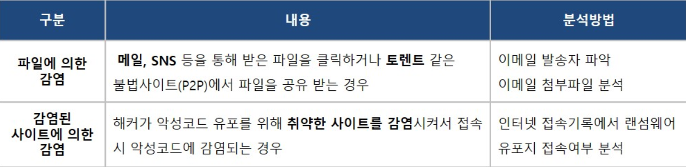
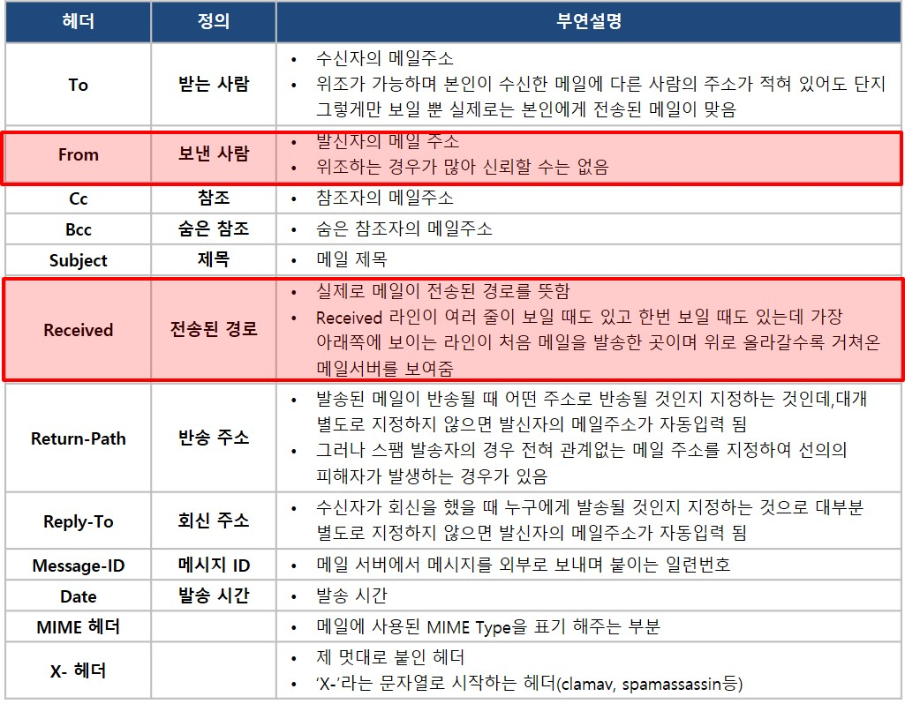

랜섬웨어 

https://www.igloo.co.kr/security-information/%EC%82%AC%EB%A1%80%EB%A1%9C-%EC%82%B4%ED%8E%B4%EB%B3%B4%EB%8A%94-%EB%9E%9C%EC%84%AC%EC%9B%A8%EC%96%B4-%EA%B0%90%EC%97%BC%EA%B2%BD%EB%A1%9C-%EB%B6%84%EC%84%9D%EB%B0%A9%EC%95%88/

1. 랜섬웨어 종류별로 감염경로나 복구가능 여부, 방지대책등이 상이할 수 있으므로 종류를 파악하는게 중요함
2. 감염 경로를 파악

파일에 의한 감염은 주로 이메일로 유포된다고 함
=> 이메일의 정보를 찾아보기

메일정보를 확인할 때 주의할 부분은 발신자(From) 정보는 위조할 수 있기 때문에 Received의 정보를 통해서 실제 발신자의 정보를 확인해야 한다. Received정보가 1개 이상 보이는 경우에는 가장 상단의 정보가 마지막 정보이기 때문에 가장 하단의 정보가 처음 보낸 발신자의 정보다. 

---
취약한 사이트를 통해 감염되는 경우
1. 브라우저의 접속 정보를 확인해야 함
Explorer, Firefox, Chrome,Safari 인터넷 접속기록 쉽게 확인하려면 BrowsingHistoryView 사용

여기서 랜섬웨어 유포지로 의심되는 URL이 있다면, 의심URL의 정상유무 파악을 위해 Virus Total이나 Malwares를 통해 분석정보 확인

2. 랜섬웨어 의심정보 확인
랜섬웨어가 설치됐다면 파일이 어떤 것인지, 언제 실행했는지 확인
=> Directory Snoop은 프로그램을 제거할 때 파일의 남겨지는 내용을 완전히 삭제해주거나, 복구 기능 지원

REGA로 레지스트리 분석 가능

3. 복구가능여부 확인
일부 랜섬웨어는 복호키가 공개되어 있어 복호화 가능

랜섬웨어 분석에서 처음 해야 하는 일이 “랜섬웨어 종류 파악”하는 이유는 이와 같이 복호화가 가능한 랜섬웨어일 가능성 때문에 확인이 필요

오카카는 파일에 의한 감염(파일 다운로드)
주요 파일이 암호화되고, 랜섬노트 생성 확인
감염 원인 파악 및 작성 중이던 지원서 복구

